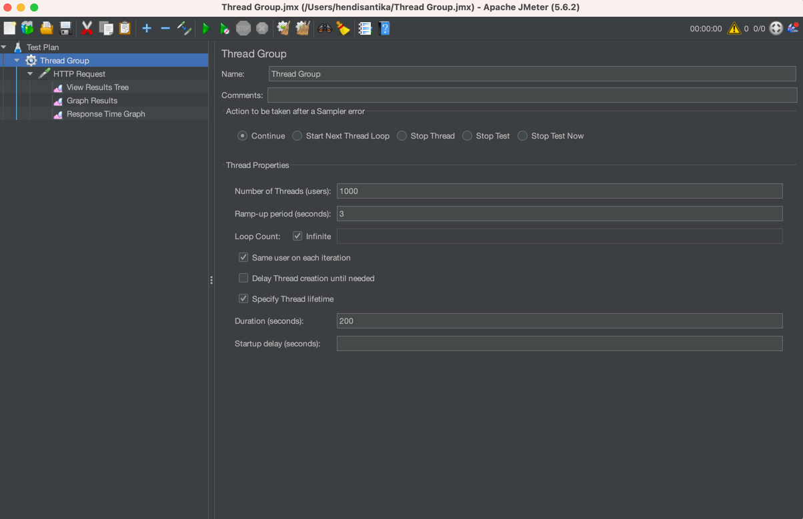
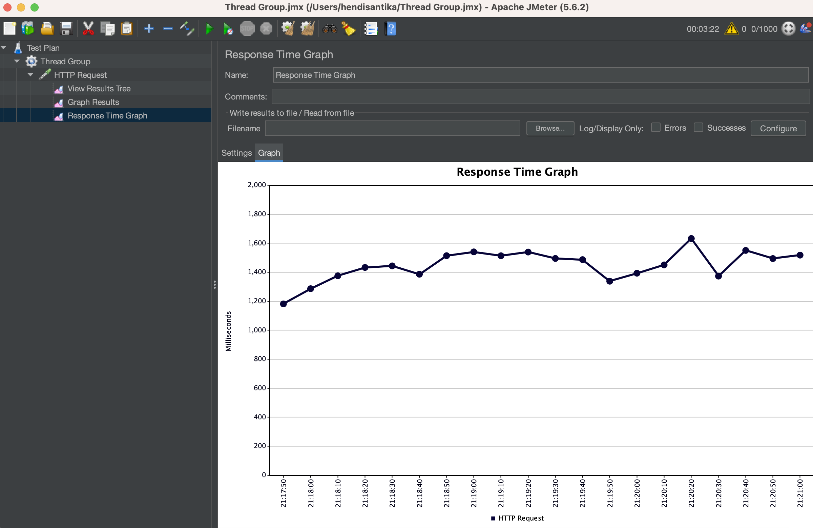

# spring-boot-virtual-thread

### Things todo list

Now let’s setup our JMeter. We will have 1000 requests, which will ramp up in 3 seconds. And it will continue like this
for a duration of 200 seconds. Every 3 seconds, 1000 GET (“/thread”) requests will be fired. We have also added a
Response Time Graph Listener.
Clearly, now the response time for concurrent 1000 requests is nearly just above 1000 ms and at some point, shoots up to
1400 seconds, which is far better than when we were using normal threads.

Clearly, when we need to utilise the underlying CPU to the fullest, we should start embracing virtual threads in our
application, and suddenly we can see that the throughput of our application has increased manifold for the same
hardware.

This is much better than switching to reactive programming, which means rewriting all your code, which is very hard to
maintain and even harder to debug.

Simply put, more users can use the application and get their response simultaneously as the first user.

1. Clone this repository: `cd https://github.com/hendisantika/spring-boot-virtual-thread.git`
2. Navigate to the folder: `cd spring-boot-virtual-thread`
3. Change your DB credentials in `application.properties` file
4. Run the application: `mvn clean spring-boot:run`

JMeter Config

Run JMeter CLI: `jmeter -n -t Thread\ Group.jmx -l -e -o report/report.csv `



Normal Thread


Virtual Thread



Link: https://qaprovider.com/discussion/show/how-to-run-jmeter-from-command-line-non-gui-mode/40

## Run Performance Testing with k6

The project includes a comprehensive k6 script (`k6.js`) for load testing the API endpoints. This script tests all three
endpoints:

1. `GET /` - Home endpoint
2. `GET /thread` - Thread endpoint that returns all products with a 1-second delay
3. `POST /save` - Endpoint that creates 1000 random products

### Load Testing Configuration

The script uses the following configuration:

- **Stages**:
  - Ramp up to 20 virtual users over 30 seconds
  - Stay at 20 virtual users for 1 minute
  - Ramp down to 0 virtual users over 30 seconds

- **Thresholds**:
  - 95% of requests should complete within 2 seconds
  - 95% of requests should be successful
  - Less than 5% of requests should fail

### Custom Metrics

The script collects the following custom metrics:

- Success rate
- Error rate
- Response time for each endpoint

### How to Run

1. Install k6 [here](https://k6.io/docs/get-started/installation/)
2. Make sure your Spring Boot application is running on port 8080 (or update the `BASE_URL` in k6.js)
3. Run the test script:
   ```
   k6 run k6.js
   k6 --duration '200s' --vus 1000 run k6.js
   ```

### Interpreting Results

After running the test, k6 will output detailed statistics including:

- HTTP request metrics (total requests, rate, duration)
- Custom metrics (success rate, error rate, response times)
- Checks (validation of responses)
- Thresholds (whether performance targets were met)

You can compare these results with the JMeter results to see the performance differences between normal threads and
virtual threads.
